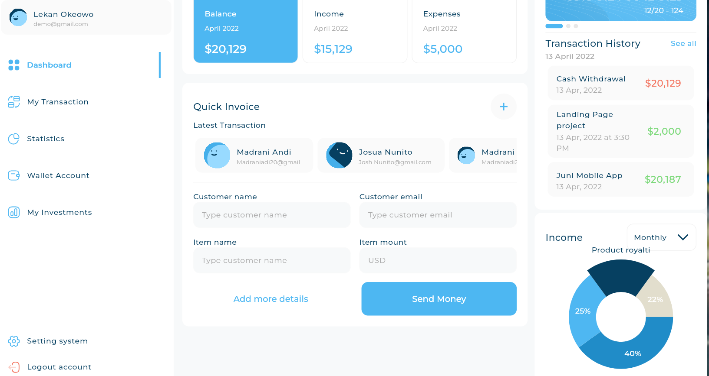
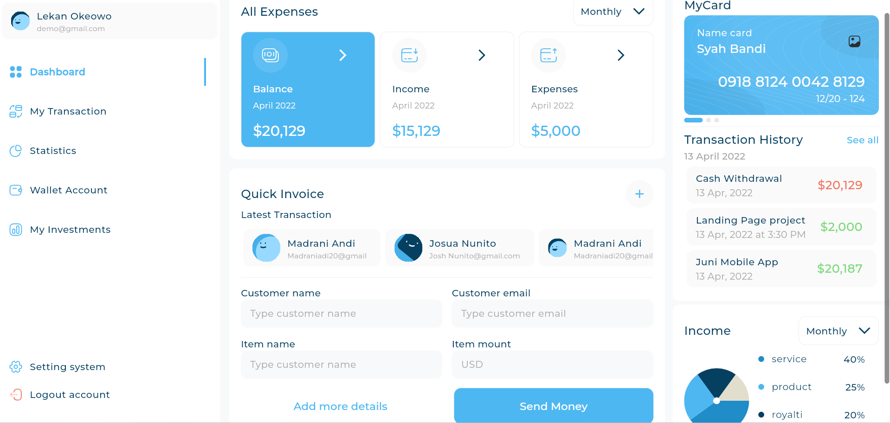
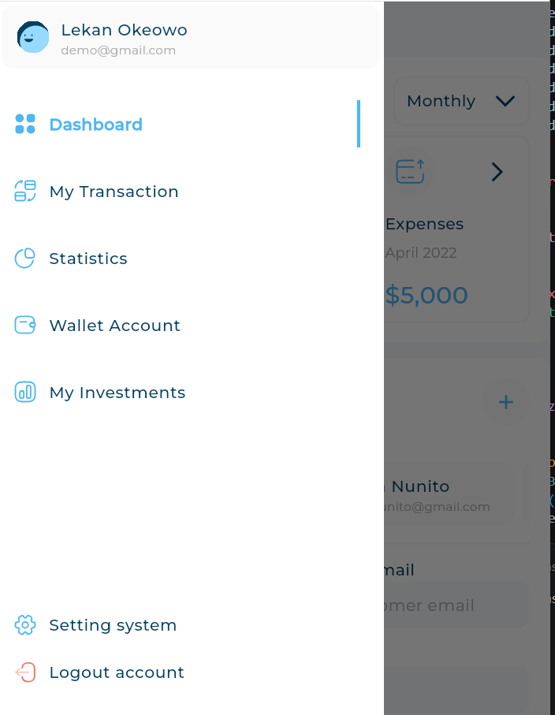
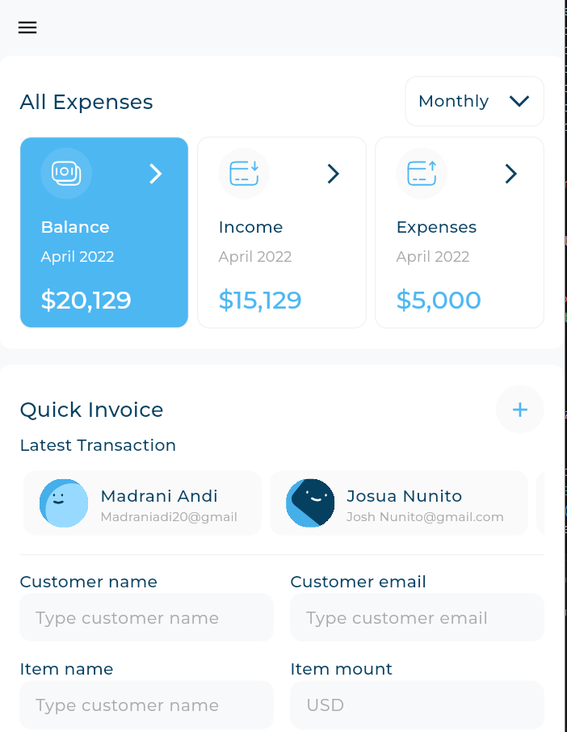
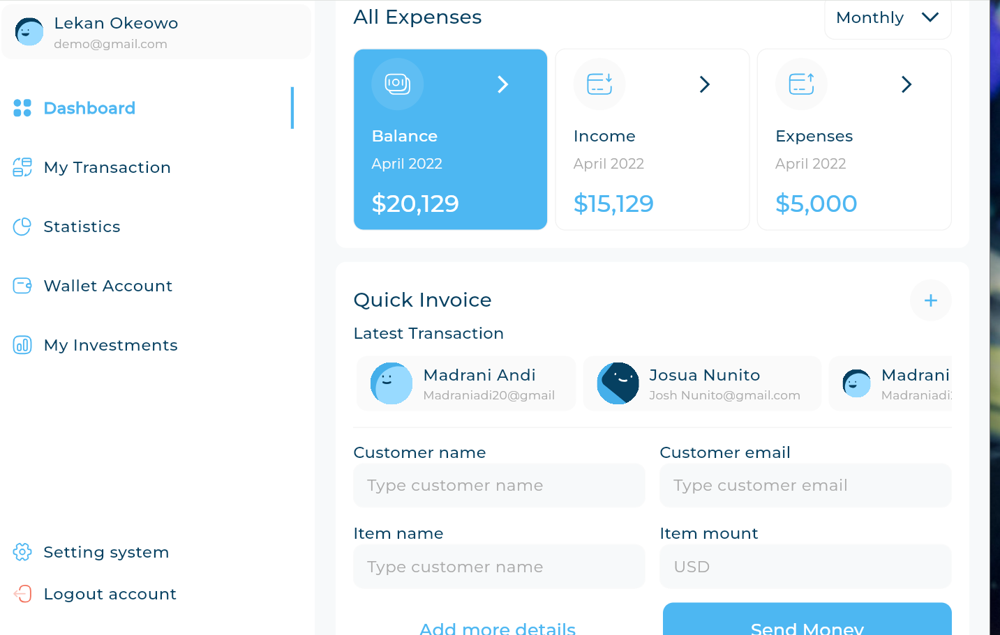

# 📊 Responsive Dashboard

A modern and responsive Flutter Dashboard application designed to provide a clean and adaptive user experience across different screen sizes.

The dashboard automatically adapts its layout for:

- 📱 Mobile
- 📲 Tablet
- 💻 Desktop

---

## 📱 App Screens

### 💻 Desktop Layout

  
  

---

### 📱 Mobile Layout

  
  

---

### 📲 Tablet Layout

  

---

## ✨ Features

- 📊 Responsive Dashboard
- 📱 Mobile Layout
- 📲 Tablet Layout
- 💻 Desktop Layout
- 📈 Expense and Income Overview
- 💳 Cards Section
- 📜 Transaction History
- 📋 Dashboard Statistics
- 🎨 Clean and Modern UI
- 📐 Adaptive Layout
- 🔄 Reusable Flutter Widgets

---

# 👨‍💻 Developer

## Mohamed Ayman

**Flutter Developer**

Passionate about building modern, responsive, and scalable Flutter applications.

---

# 📬 Contact

If you have any questions, suggestions, or feedback, feel free to reach out.

- GitHub: https://github.com/mohamedayman891
- LinkedIn: https://www.linkedin.com/in/mohamed-ayman09

---

## ⭐ Support

If you enjoyed this project, consider giving it a ⭐ on GitHub.

It really helps and motivates me to build more open-source Flutter projects.

---

### Made with ❤️ using Flutter

